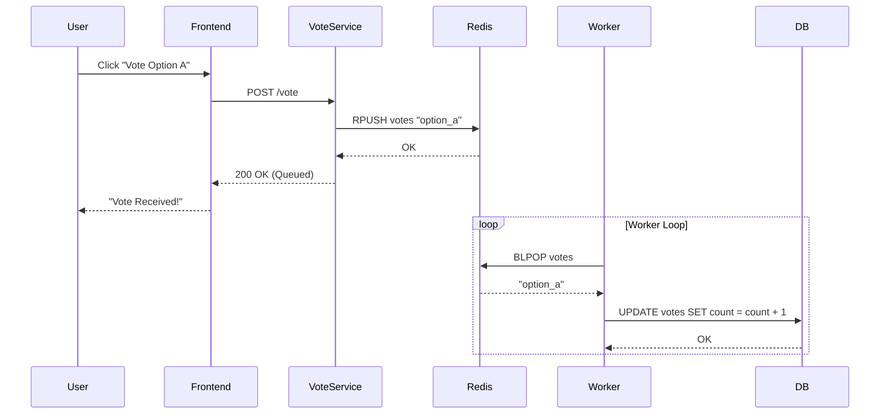
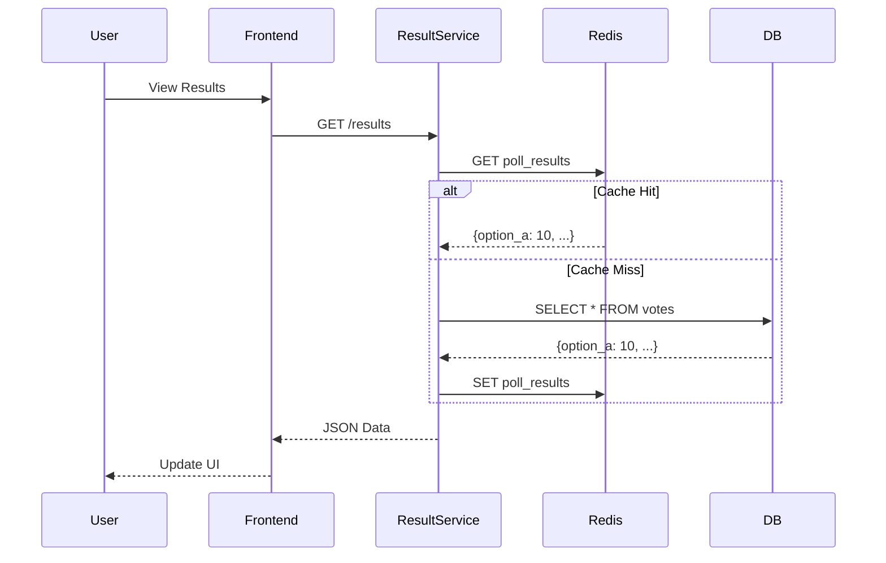
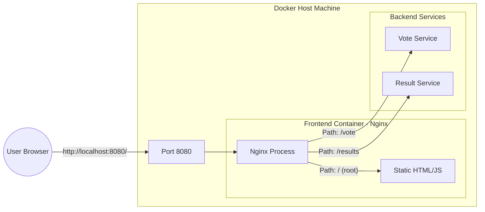
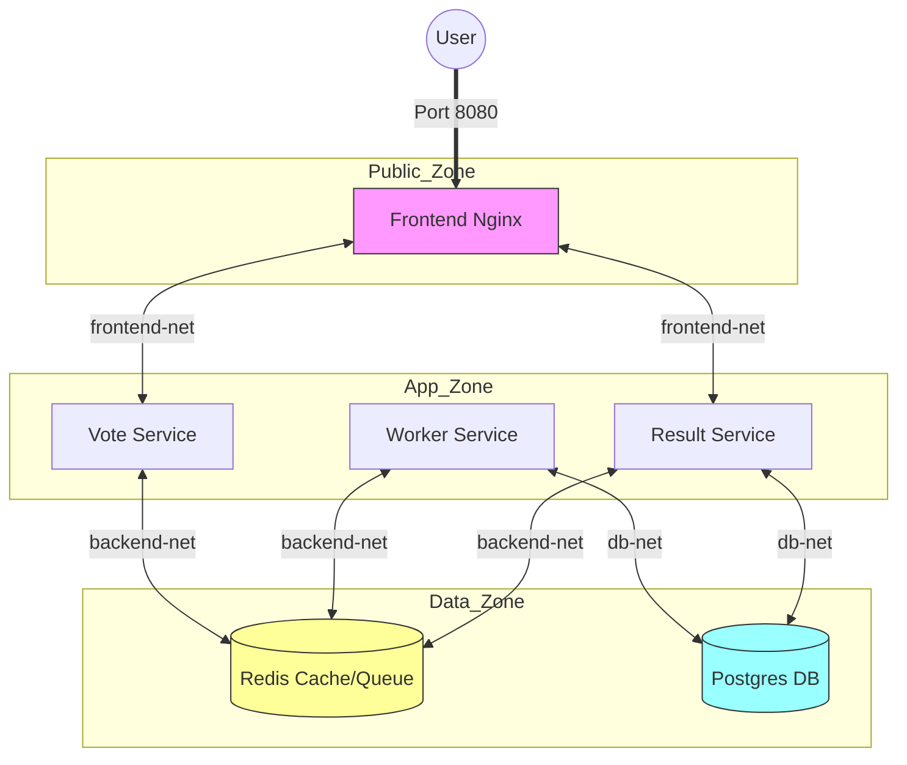
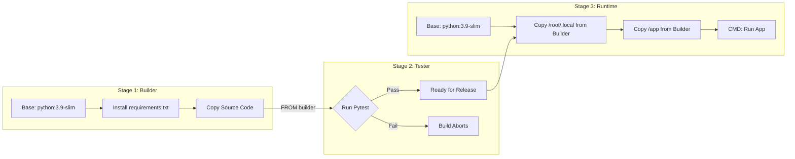

# Docker Polling App (Worker Architecture)

## Overview
This project implements a scalable voting application using a microservices architecture. It demonstrates complex Docker concepts including:
- **6 Separate Services**: Frontend, Vote, Result, Worker, Redis, Database.
- **Multi-stage Builds**: Separate Build, Test, and Runtime stages.
- **Network Isolation**: Dedicated networks for frontend, backend, and database tiers.
- **Asynchronous Processing**: Using Redis as a queue and a Python worker for database writes.

## Architecture

### Services
1.  **Frontend**: Nginx serving static HTML/JS and acting as a reverse proxy.
2.  **Vote Service**: Python Flask API that accepts votes and pushes them to Redis.
3.  **Result Service**: Python Flask API that reads vote counts from PostgreSQL.
4.  **Worker Service**: Python script that watches Redis and writes to PostgreSQL.
5.  **Redis**: In-memory message broker (Queue).
6.  **Postgres**: Persistent relational database.

### Sequence Diagram (Voting Flow)


### Sequence Diagram (Results Flow)


## Setup & Run

1.  **Build and Start**:
    ```bash
    docker-compose up --build
    ```
2.  **Access App**:
    Open `http://localhost:8080` in your browser.

## Network Strategy & Architecture

Our networking strategy is designed for **Defense in Depth**. We use three isolated Docker networks to strictly control which services can communicate.

### 1. Frontend Network (`frontend-net`)
*   **Who is here?**: `Frontend`, `Vote Service`, `Result Service`.
*   **What happens here?**: The Frontend (Nginx) receives user traffic and forwards it to the APIs.
*   **Access Rule**: The Frontend **cannot** access Redis or the Database. It only talks to the API containers.

### 2. Backend Network (`backend-net`)
*   **Who is here?**: `Vote Service`, `Worker Service`, `Result Service`, `Redis`.
*   **What happens here?**: This is the "Queue" layer. Services push/pop messages to Redis.
*   **Access Rule**: The **Vote Service** is here, so it can push votes to Redis. BUT, it is NOT in the Database network.

### 3. Database Network (`db-net`)
*   **Who is here?**: `Worker Service`, `Result Service`, `Database`.
*   **What happens here?**: Permanent storage.
*   **Access Rule**: Only the **Worker** (to write) and **Result Service** (to read) can touch the DB. The **Vote Service** is completely blocked.

### Access Control Matrix (Who can talk to whom?)

| Service | Can Access... | **CANNOT** Access (Blocked) |
| :--- | :--- | :--- |
| **Vote Service** | Redis (Queue) | **Database** (Postgres) |
| **Frontend** | Vote API, Result API | Redis, Database |
| **Worker** | Redis, Database | Frontend |
| **Result Service** | Redis, Database | - |

### Security Scenarios (Why this matters)

#### 🔴 Scenario A: The "Vote Service" Breach
*   **The Attack**: A hacker finds a bug in your Python code and gains control of the `vote-service` container.
*   **The Goal**: They want to run `SELECT * FROM votes` to steal data or `DROP TABLE` to destroy it.
*   **The Outcome**: **FAILED.**
    *   The `vote-service` is only connected to `frontend-net` and `backend-net`.
    *   The Database is on `db-net`.
    *   The hacker tries to connect to `db:5432` but the network route **does not exist**. They are trapped.

#### 🔴 Scenario B: The "Thundering Herd" (Traffic Spike)
*   **The Attack**: 10,000 users vote at the exact same second.
*   **The Goal**: Crash the Database by opening too many connections.
*   **The Outcome**: **MITIGATED.**
    *   The votes go to **Redis** (which handles millions of ops/sec).
    *   The **Database** is untouched by the spike.
    *   The **Worker** quietly processes the queue at a safe speed (e.g., 50 writes/sec). The Database stays healthy.

## Nginx Reverse Proxy Strategy

We use Nginx in the `frontend` container not just to serve HTML, but as a **Reverse Proxy**. This simplifies the client-side code and eliminates CORS (Cross-Origin Resource Sharing) issues.

### The Problem
Without Nginx, your browser would need to talk to 3 different ports:
1.  `localhost:8080` (HTML)
2.  `localhost:5000` (Vote API)
3.  `localhost:5001` (Result API)
This triggers browser security warnings (CORS) and looks messy.

### The Solution (Reverse Proxy)
With Nginx, the browser only talks to **ONE** port (`localhost:8080`). Nginx looks at the URL path and routes the traffic internally.

### Redis Queue Commands Explained
*   **RPUSH**: Stands for **R**ight **PUSH**.
    *   **Meaning**: "Push a value onto the Right side (End) of a list."
    *   **Usage**: The Vote Service adds new votes to the end of the queue.

*   **BLPOP**: Stands for **B**locking **L**eft **POP**.
    *   **Meaning**: "Pop a value from the Left side (Start) of a list, and **Block** (wait) if empty."
    *   **Usage**: The Worker takes the oldest vote from the start of the queue. If there are no votes, it pauses execution (blocks) until one arrives.

### Nginx Routing Diagram


### Configuration Explained (`nginx.conf`)
```nginx
server {
    listen 80;

    # 1. Static Files
    location / {
        root /usr/share/nginx/html; # Serves index.html
    }

    # 2. Vote API Proxy
    location /vote {
        # 'http://vote' refers to the Docker Service Name
        proxy_pass http://vote:80/vote;
    }

    # 3. Result API Proxy
    location /results {
        proxy_pass http://result:80/results;
    }
}
```

### Network Diagram
The following diagram illustrates which services bridges which networks:



## Dockerfile Strategy
All Python services use a **3-Stage Build Process**:
1.  **Builder**: Installs dependencies and compiles wheels.
2.  **Tester**: Runs unit tests (`pytest`). If tests fail, the build fails.
3.  **Runtime**: Copies only necessary artifacts from Builder to a minimal slim image.

### Dockerfile Pipeline Diagram

