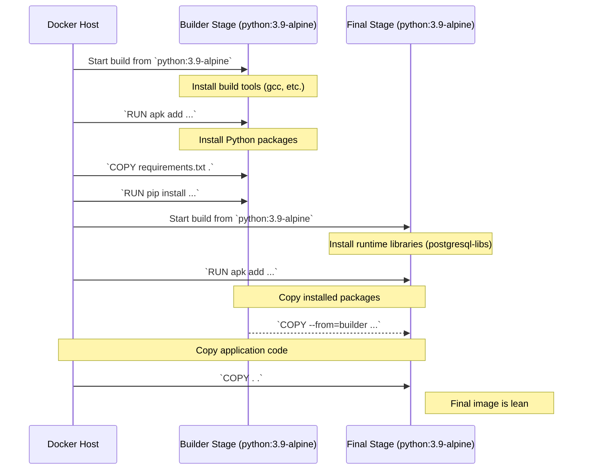
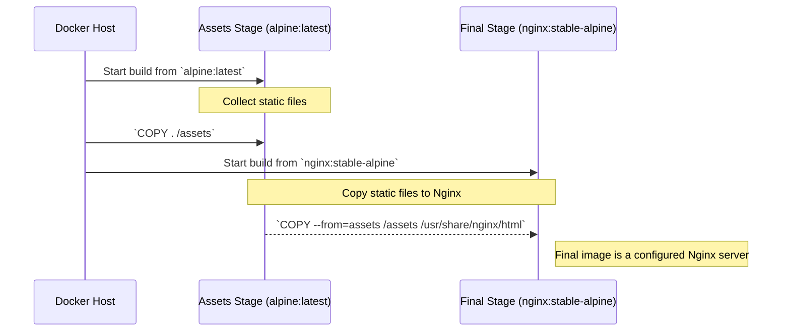
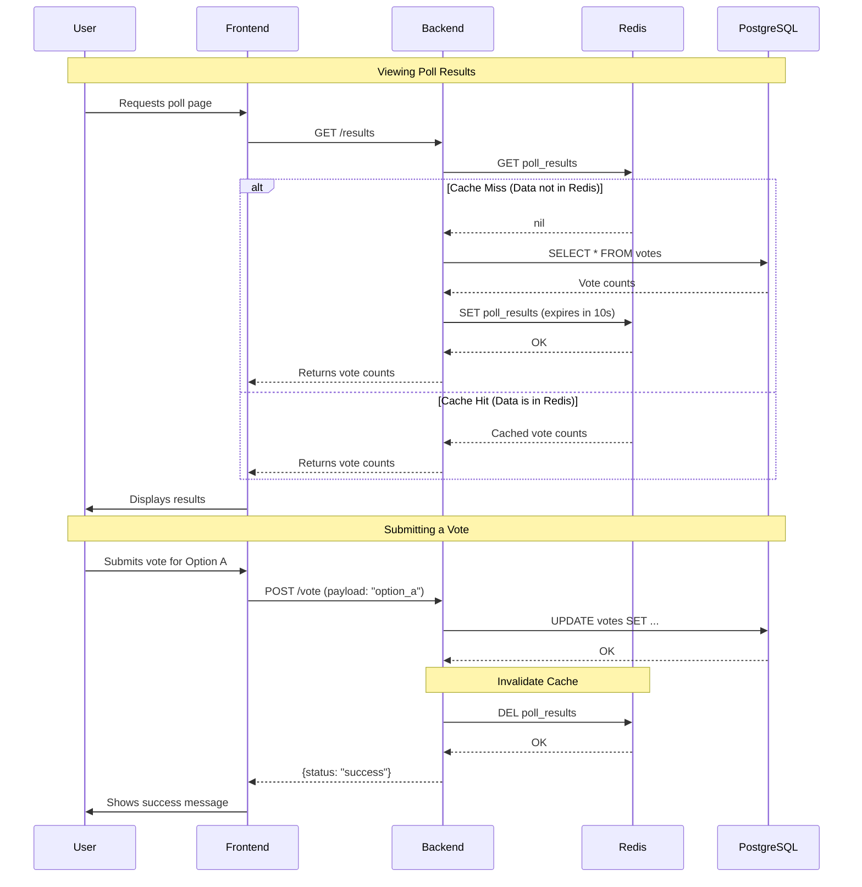

# Docker Polling App

This is a multi-service polling application built to demonstrate a moderately complex Docker architecture.

## How to Run

1.  **Start the application:**
    ```bash
    docker-compose up --build
    ```

2.  **Access the application:**
    Open your browser and go to `http://localhost:8080`.

## Pushing Images to Docker Hub

1.  **Log in to Docker Hub:**
    ```bash
    docker login
    ```

2.  **Build the images:**
    ```bash
    docker-compose build
    ```

3.  **Tag the images:**
    ```bash
    docker tag docker-polling-app_backend <your-dockerhub-username>/polling-app-backend:latest
    docker tag docker-polling-app_frontend <your-dockerhub-username>/polling-app-frontend:latest
    ```

4.  **Push the images:**
    ```bash
    docker push <your-dockerhub-username>/polling-app-backend:latest
    docker push <your-dockerhub-username>/polling-app-frontend:latest
    ```

## Updating an Image on Docker Hub

If you make changes to your application code (for example, updating the Python dependencies in the `backend`), you need to rebuild your Docker image and push the new version to Docker Hub. The process is very similar to pushing for the first time.

1.  **Re-build the specific service's image:**
    If you only changed the backend, you can rebuild just that service to save time.
    ```bash
    docker-compose build backend
    ```

2.  **Log in to Docker Hub (if you aren't already):**
    ```bash
    docker login
    ```

3.  **Tag the newly built image:**
    The image name is defined by the project directory name (`docker-polling-app`) and the service name (`backend`), which becomes `docker-polling-app_backend`.
    ```bash
    docker tag docker-polling-app_backend <your-dockerhub-username>/polling-app-backend:latest
    ```

4.  **Push the updated image:**
    ```bash
    docker push <your-dockerhub-username>/polling-app-backend:latest
    ```
This will replace the `latest` tag on your Docker Hub repository with the new image you just built.

### 3. Image Optimization with Multi-Stage Builds

Docker image size is a critical factor in development and deployment. Smaller images are faster to build, push, and pull, and they reduce storage costs and improve security by minimizing the attack surface. This project uses **multi-stage builds** in both the frontend and backend `Dockerfile`s to create lean, optimized final images.

A multi-stage build uses multiple `FROM` instructions in a `Dockerfile`. Each `FROM` starts a new build stage. You can selectively copy artifacts—like compiled code or installed packages—from one stage to another, leaving behind build tools and other unnecessary files.

---

### `backend/Dockerfile` Explained

The backend `Dockerfile` is structured in two stages to separate the build environment from the final runtime environment.

```dockerfile
# Stage 1: The "builder" stage
# This stage installs all dependencies, including build-time requirements.
FROM python:3.9-alpine AS builder

# Install OS-level dependencies needed for building Python packages
RUN apk add --no-cache gcc python3-dev musl-dev postgresql-dev

# Set the working directory
WORKDIR /app

# Copy the requirements file and install Python packages
COPY requirements.txt .
RUN pip install --no-cache-dir -r requirements.txt

# Stage 2: The "final" stage
# This stage creates the lean, final runtime image.
FROM python:3.9-alpine

# Install only the required runtime OS-level libraries
RUN apk add --no-cache postgresql-libs

# Set the working directory
WORKDIR /app

# Copy the installed Python packages from the "builder" stage
COPY --from=builder /usr/local/lib/python3.9/site-packages /usr/local/lib/python3.9/site-packages
COPY --from=builder /app /app

# Copy the application code
COPY . .

# Expose the port the app runs on
EXPOSE 5000

# Define the command to run the application
CMD ["python", "app.py"]
```

*   **Stage 1 (`builder`):**
    *   Starts from `python:3.9-alpine`.
    *   Installs build-time dependencies like `gcc` and `python3-dev`, which are required to compile some Python packages (e.g., `psycopg2-binary`).
    *   Installs the Python packages from `requirements.txt`. At the end of this stage, all the necessary packages are installed, but the image also contains the large build tools we don't need at runtime.

*   **Stage 2 (Final Image):**
    *   Starts fresh from the same lightweight `python:3.9-alpine` base image.
    *   Installs *only* the runtime OS dependencies, like `postgresql-libs`, which are the shared libraries needed to connect to PostgreSQL.
    *   The `COPY --from=builder ...` commands are the key to this pattern. They copy the installed Python packages from the `builder` stage into the final image, leaving the build tools behind.
    *   Finally, it copies the application code and sets the `CMD`.

This process results in a final image that is significantly smaller and more secure than a traditional single-stage build.

---

### `frontend/Dockerfile` Explained

While the frontend is just serving static files and is already very small, using a multi-stage build is a best practice that makes the `Dockerfile`'s intent clearer and provides a scalable pattern for when the frontend becomes more complex (e.g., requiring a JavaScript build step).

```dockerfile
# Stage 1: The "assets" stage
# For a simple static site, this stage just holds the source files.
# In a more complex project, this stage would build the assets (e.g., using Node.js).
FROM alpine:latest AS assets

# Copy the static files into a temporary location in this stage.
COPY . /assets

# Stage 2: The "final" stage
# This is the lean runtime image that will serve the files.
FROM nginx:stable-alpine

# Copy the static files from the "assets" stage into the Nginx public directory.
COPY --from=assets /assets /usr/share/nginx/html

# Expose port 80 for the Nginx server.
EXPOSE 80
```

*   **Stage 1 (`assets`):**
    *   This stage is extremely simple: it starts from a minimal `alpine` image and copies the frontend's static files (`index.html`, `style.css`, etc.) into an `/assets` directory. It acts as a temporary holding area for our content.

*   **Stage 2 (Final Image):**
    *   This stage starts from the official `nginx:stable-alpine` image, which is a fully configured, lightweight web server.
    *   The `COPY --from=assets ...` command copies the static files from the `assets` stage into the Nginx public directory (`/usr/share/nginx/html`), which is where Nginx serves files from by default.

This cleanly separates the content (the "what") from the server (the "how"). If we later needed to add a build step with Node.js, we would simply perform that build in the `assets` stage, and the final Nginx stage would remain unchanged.

### Visualizing the Multi-Stage Build Process

The following diagrams illustrate the flow of the multi-stage builds for both the backend and frontend services.

#### Backend Multi-Stage Build Flow

This diagram shows how the backend image is built. The `builder` stage creates the necessary Python environment with all dependencies, and the `final` stage copies only the essential components, resulting in a lean image.



#### Frontend Multi-Stage Build Flow

This diagram illustrates the simpler frontend build process. The `assets` stage acts as a container for the static files, which are then served by a clean Nginx instance in the `final` stage.



## Application Architecture and Sequence Diagram

The following diagram illustrates the flow of requests through the application. It covers viewing results (with both a cache hit and a cache miss) and submitting a new vote.



## Docker Architecture Deep Dive

This project uses Docker Compose to define and run a multi-container application. The architecture is designed to be scalable and demonstrates key Docker concepts, particularly networking.

### Understanding Environment Variables

A common question is about the `environment` variables in `docker-compose.yml` and whether they are "standard". The answer is that it depends entirely on the Docker image being used.

*   **Variables for the `db` service (`postgres:13` image):**
    *   `POSTGRES_DB`, `POSTGRES_USER`, `POSTGRES_PASSWORD`
    *   **These are standard variables defined by the official PostgreSQL image.** The maintainers of the image have written scripts that run when the container starts. These scripts look for these specific environment variables and use their values to initialize the database.
    *   **Resource:** To find these variables for any official image, you must look at its documentation on **Docker Hub**. For example, the [official PostgreSQL image documentation](https://hub.docker.com/_/postgres) has a section titled "Environment Variables" that lists all the configuration options.

*   **Variables for the `backend` service (our custom image):**
    *   `DB_HOST`, `DB_NAME`, `DB_USER`, `DB_PASSWORD`, `REDIS_HOST`
    *   **These are custom variables defined by us for our own application.** We chose these names in our Python code (`app.py`), where we use `os.environ.get(...)` to read them. We could have named them anything (e.g., `DATABASE_URL`, `CACHE_HOST`), as long as the name in `docker-compose.yml` matches the name being read in the code.

### Docker Networking Explained

When you run `docker-compose up`, Docker Compose automatically creates a **default bridge network** for the entire project. Every service defined in the `docker-compose.yml` file is attached to this network.

This has two major benefits:
1.  **Service Discovery:** Containers on the same network can find and communicate with each other using their service names as hostnames. For example, the `backend` container can connect to the database at `db:5432` and the cache at `redis:6379`. Docker's internal DNS server resolves these service names to the correct container's IP address.
2.  **Isolation:** The application stack is isolated from the host machine and from other Docker containers running on different networks. Only the ports we explicitly publish (like `8080:80` for the frontend) are accessible from the outside.

### Docker Volumes for Data Persistence

One of the most important concepts to understand when working with Docker is how data is managed. Containers are, by design, ephemeral. This means that if you stop and remove a container, any data created inside it is lost forever. This is perfectly fine for stateless services, but for a database like PostgreSQL, it would be a disaster.

This is where **Docker Volumes** come in. Volumes are the preferred mechanism for persisting data generated by and used by Docker containers.

**Why use Volumes?**

1.  **Data Persistence:** As mentioned, volumes allow your data to live on even if the container is removed. In our project, the `db` service stores its data files in a volume, so our polling data isn't lost every time we restart the application.
2.  **Decoupling Data from the Container:** Volumes exist on the host machine, managed by Docker. The container just mounts the volume to a specific path. This separates the data's lifecycle from the container's lifecycle.
3.  **Easier Backups and Management:** Because Docker manages the volume, you can easily use Docker commands to back it up, inspect it, or migrate it.
4.  **Better Performance:** On Linux, Docker-managed volumes are stored in a part of the host filesystem (`/var/lib/docker/volumes/`) and are optimized for performance.

**How Volumes are Used in This Project**

In our `docker-compose.yml`, you'll see two `volumes` sections:

1.  **Under the `db` service:**
    ```yaml
    services:
      db:
        # ...
        volumes:
          - db-data:/var/lib/postgresql/data
    ```
    This line tells Docker to do the following:
    *   Take the named volume `db-data`.
    *   Mount it to the path `/var/lib/postgresql/data` inside the `db` container.
    *   This specific path is not random; it's the directory that the official PostgreSQL image uses to store all its database files.

2.  **At the top level of the file:**
    ```yaml
    volumes:
      db-data:
    ```
    This is a declaration. It formally defines a **named volume** called `db-data`. Docker Compose will create this volume if it doesn't already exist. Using named volumes is the recommended approach for managing persistent data. The actual data is stored on the host machine in a directory managed by Docker, but we only ever need to refer to it by its name, `db-data`.

By combining these two configurations, we ensure that our PostgreSQL database writes its data to a persistent location, safeguarding it from container restarts and removals.

### `docker-compose.yml` Line-by-Line Explanation

This file is the blueprint for our entire application stack.

```yaml
services:
  frontend:
    build: ./frontend
    ports:
      - "8080:80"
    depends_on:
      - backend

  backend:
    build: ./backend
    ports:
      - "5000:5000"
    environment:
      - DB_HOST=db
      - DB_NAME=postgres
      - DB_USER=postgres
      - DB_PASSWORD=postgres
      - REDIS_HOST=redis
    depends_on:
      - db
      - redis

  db:
    image: postgres:13
    environment:
      - POSTGRES_DB=postgres
      - POSTGRES_USER=postgres
      - POSTGRES_PASSWORD=postgres
    volumes:
      - db-data:/var/lib/postgresql/data

  redis:
    image: redis:alpine

volumes:
  db-data:
```

---

**`services:`**
*   This is the root key where we define all the individual containers (services) that make up our application.

---

**`frontend:`**
*   **`build: ./frontend`**: This tells Docker Compose to build a custom Docker image for this service. It will look for a `Dockerfile` inside the `./frontend` directory and use that to build the image. This is one of our two custom images.
*   **`ports: - "8080:80"`**: This maps port `8080` on the **host machine** to port `80` inside the **container**. This is how you can access the frontend in your browser at `http://localhost:8080`.
*   **`depends_on: - backend`**: This controls the startup order. The `frontend` service will not start until the `backend` service is up and running. This prevents the frontend from starting before the API it relies on is available.

---

**`backend:`**
*   **`build: ./backend`**: Similar to the frontend, this builds a custom image from the `Dockerfile` located in the `./backend` directory.
*   **`ports: - "5000:5000"`**: This maps port `5000` on the host to port `5000` in the container. This isn't strictly necessary for the application to work (since the frontend communicates with the backend over the internal Docker network), but it's useful for direct API testing during development.
*   **`environment:`**: This section sets environment variables inside the `backend` container. This is how we pass configuration, like database credentials and the Redis hostname, to our Python application without hardcoding them.
    *   `DB_HOST=db`: The hostname for the database is simply `db`, the name of the service.
    *   `REDIS_HOST=redis`: The hostname for the cache is `redis`, the name of the service.
*   **`depends_on: - db - redis`**: The `backend` will wait for both the `db` and `redis` services to start before it starts itself. This ensures that its dependencies are ready before it tries to connect to them.

---

**`db:`**
*   **`image: postgres:13`**: Instead of building from a Dockerfile, this tells Docker to pull the official `postgres` image (version 13) from Docker Hub.
*   **`environment:`**: These variables are used by the PostgreSQL image itself to initialize the database.
*   **`volumes: - db-data:/var/lib/postgresql/data`**: This is one of the most critical lines for a stateful service. It maps a **named volume** called `db-data` to the directory inside the container where PostgreSQL stores its data. This ensures that even if you stop and remove the `db` container, the data will persist in the volume on the host machine and will be re-mounted the next time you start the service.

---

**`redis:`**
*   **`image: redis:alpine`**: Pulls the lightweight, Alpine-based official `redis` image from Docker Hub. This service requires no further configuration for our use case.

---

**`volumes:`**
*   **`db-data:`**: This top-level key formally declares the named volume `db-data`. This allows us to easily manage the volume (e.g., inspect it, back it up, or remove it) using Docker commands.

### Dockerfile Line-by-Line Explanation

The `Dockerfile` is the instruction manual for building a custom Docker image. We have two in our project: one for the `backend` and one for the `frontend`.

---

#### `backend/Dockerfile`

This file builds the image for our Python Flask application.

```dockerfile
# Start from a Python base image
FROM python:3.9-alpine

# Set the working directory
WORKDIR /app

# Copy the requirements file and install dependencies
# We install build dependencies, run pip, then remove them in a single RUN command
# to keep the final image layer smaller.
COPY requirements.txt .
RUN apk add --no-cache --virtual .build-deps gcc python3-dev musl-dev postgresql-dev && \
    pip install --no-cache-dir -r requirements.txt && \
    apk del .build-deps

# Copy the application code
COPY . .

# Expose the port the app runs on
EXPOSE 5000

# Define the command to run the application
CMD ["python", "app.py"]
```

*   **`FROM python:3.9-alpine`**: This specifies the base image for our build. Instead of starting from scratch, we start with the official `python:3.9-alpine` image, which gives us a minimal Linux environment with Python 3.9 pre-installed. The `alpine` tag means it's based on Alpine Linux, which is extremely lightweight and helps keep our final image size small.

*   **`WORKDIR /app`**: This sets the working directory for all subsequent commands in the Dockerfile (`RUN`, `CMD`, `COPY`, etc.). If the directory doesn't exist, it will be created. This means our code and dependencies will be located in the `/app` directory inside the container.

*   **`COPY requirements.txt .`**: This copies the `requirements.txt` file from our local `backend` directory into the current working directory (`/app`) inside the container. We copy this file first, before the rest of the code, to take advantage of Docker's layer caching. If the `requirements.txt` file doesn't change, Docker can reuse the dependency installation layer on subsequent builds, making them much faster.

*   **`RUN apk add ... && pip install ... && apk del ...`**: This is the most complex command, but it's a highly optimized, multi-step process executed in a single layer:
    1.  `apk add --no-cache --virtual .build-deps gcc python3-dev musl-dev postgresql-dev`: This uses the Alpine package manager (`apk`) to install temporary build-time dependencies. Some Python packages, like `psycopg2`, need to be compiled from source, and this requires tools like a C compiler (`gcc`) and development headers (`python3-dev`, `musl-dev`, `postgresql-dev`).
        *   `--no-cache`: Prevents `apk` from storing a package index cache, saving space.
        *   `--virtual .build-deps`: Creates a temporary, virtual package that we can easily remove later.
    2.  `pip install --no-cache-dir -r requirements.txt`: This is the standard command to install our Python dependencies. `--no-cache-dir` disables pip's cache, again saving space in the final image.
    3.  `apk del .build-deps`: After the dependencies are successfully installed, we no longer need the build tools. This command completely removes the virtual package and all its contents, ensuring our final image is not bloated with unnecessary build tools.

*   **`COPY . .`**: This copies the rest of the files and directories from our local `backend` directory (like `app.py`) into the `/app` directory in the container. The `.dockerignore` file ensures that unnecessary files (like `.git` or `__pycache__`) are excluded from this copy.

*   **`EXPOSE 5000`**: This instruction is documentation. It informs Docker that the container listens on the specified network port at runtime. It doesn't actually publish the port; the `-p` flag in `docker run` or the `ports` section in `docker-compose.yml` is what makes the port accessible from the host.

*   **`CMD ["python", "app.py"]`**: This specifies the default command to run when a container is started from this image. It will execute `python app.py`, starting our Flask web server. There can only be one `CMD` instruction in a Dockerfile.

---

#### `frontend/Dockerfile`

This file builds the image for our Nginx web server, which serves the static HTML, CSS, and JavaScript files.

```dockerfile
# Start from an Nginx base image
FROM nginx:stable-alpine

# Copy the static files into the Nginx public directory
COPY . /usr/share/nginx/html

# Expose port 80
EXPOSE 80
```

*   **`FROM nginx:stable-alpine`**: We start with the official `nginx:stable-alpine` image. This gives us a pre-configured, lightweight Nginx web server.

*   **`COPY . /usr/share/nginx/html`**: This is the core instruction for this image. It copies all the files from our local `frontend` directory (`index.html`, `style.css`, etc.) into the directory `/usr/share/nginx/html` inside the container. This specific path is the default location where Nginx looks for files to serve. The `.dockerignore` file in the `frontend` directory ensures we only copy essential files.

*   **`EXPOSE 80`**: This documents that the container listens on port 80, which is the default port for HTTP traffic and the port that the Nginx server is configured to listen on by default.
