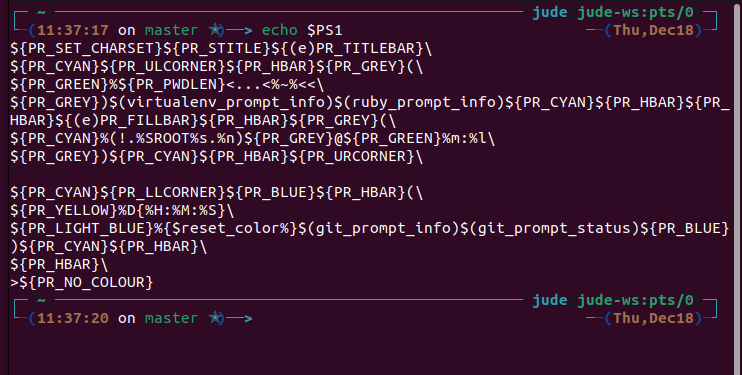

# Zsh Configuration Analysis

This document analyzes the `.zshrc` file, explaining the various configurations and customizations.

## Oh My Zsh

This section covers the configuration of Oh My Zsh, a framework for managing Zsh configuration.

### Theme

The theme setting controls the appearance of the shell prompt.

- **`ZSH_THEME="jonathan"`**: This sets the theme to "jonathan".

**Example**:
The "jonathan" theme typically displays the current directory, Git branch, and other useful information in the prompt.

#### Understanding the Zsh Prompt (`PS1`)

The appearance of the prompt is controlled by the `PS1` variable (and `PROMPT` which is an alias for `PS1` in zsh). The complex string you see when you run `echo $PS1` is a template that Zsh uses to build your prompt. It contains special character sequences called "prompt escapes".

Here are some common prompt escapes and what they represent:

-   `%~`: Displays the current working directory, with `~` representing the home directory.
-   `%n`: The username.
-   `%m`: The hostname.
-   `%l`: The current terminal line.
-   `%D{string}`: The current date, formatted according to `string`. For example, `%D{%H:%M:%S}` shows the time as hours:minutes:seconds.
-   `%F{color}` and `%f`: Change the text color. `%F{red}` starts red text, and `%f` resets it.
-   `%K{color}` and `%k`: Change the background color.
-   `%B` and `%b`: Start and end bold text.
-   `%U` and `%u`: Start and end underlined text.

Oh My Zsh themes, like "jonathan", create a complex `PS1` string using these escapes to produce a visually informative prompt. They often include logic to display Git branch information, command exit statuses, and other useful details.

#### Deconstructing Your `PS1`

Here is a visual example of the prompt in action:



Let's break down the `PS1` value from your shell. Note that many of the `${VAR}` parts are variables set by the "jonathan" theme to insert colors and symbols.

```zsh
${PR_SET_CHARSET}${PR_STITLE}${(e)PR_TITLEBAR}\
${PR_CYAN}${PR_ULCORNER}${PR_HBAR}${PR_GREY}(\
${PR_GREEN}%${PR_PWDLEN}<...<%~%<<\
${PR_GREY})$(virtualenv_prompt_info)$(ruby_prompt_info)${PR_CYAN}${PR_HBAR}${PR_HBAR}${(e)PR_FILLBAR}${PR_HBAR}${PR_GREY}(\
${PR_CYAN}%(!.%SROOT%s.%n)${PR_GREY}@${PR_GREEN}%m:%l\
${PR_GREY})${PR_CYAN}${PR_HBAR}${PR_URCORNER}\

${PR_CYAN}${PR_LLCORNER}${PR_BLUE}${PR_HBAR}(\
${PR_LIGHT_BLUE}%{$reset_color%}$(git_prompt_info)$(git_prompt_status)${PR_BLUE})${PR_CYAN}${PR_HBAR}\
${PR_HBAR}\
>${PR_NO_COLOUR}
```

-   **Line 1**: Sets the terminal title.
-   **Line 2**: Draws the top-left corner of the prompt, with colors.
-   **Line 3**: `%~` displays the current directory. The surrounding code is for path truncation.
-   **Line 4**: `$(virtualenv_prompt_info)` and `$(ruby_prompt_info)` are functions that display information about the current Python and Ruby environments, respectively.
-   **Line 5**: `%n` (username), `%m` (hostname), and `%l` (terminal line). The `%(!.%SROOT%s.%n)` part is a conditional that changes the prompt if you are root.
-   **Line 7**: Draws the bottom-left corner.
-   **Line 9**: `$(git_prompt_info)` and `$(git_prompt_status)` are functions that display Git information.
-   **Line 11**: `>` is the final character of the prompt before your cursor.

This detailed structure is what creates the two-line, feature-rich prompt you see in your terminal.

#### Experimenting with Your Prompt

To understand what each part of the prompt does, you can experiment by setting the `PS1` variable directly in your terminal. These changes are temporary and will only last for the current session. To revert to your normal prompt, simply open a new terminal window.

**Important Note**: The examples below are for **Zsh**. If you are in a **Bash** shell (which uses `$` as a default prompt and shows `-bash` in errors), these commands will not work as expected.

### For Zsh Users

**1. A Minimal Prompt**

This will give you a very basic prompt with just the current directory and a `>` symbol.

```zsh
PS1="%~ > "
```

**2. Adding User and Host**

This adds the `user@host` information to your prompt.

```zsh
PS1="%n@%m %~ > "
```

**3. The Time and Git Info (Bottom Line)**

This isolates the bottom line of your prompt. **Note**: This command will only work in your fully configured Zsh shell, as it relies on functions and variables set by your Oh My Zsh theme.

```zsh
PS1='${PR_CYAN}${PR_LLCORNER}${PR_BLUE}${PR_HBAR}(${PR_LIGHT_BLUE}%{$reset_color%}$(git_prompt_info)$(git_prompt_status)${PR_BLUE})${PR_CYAN}${PR_HBAR}${PR_HBAR}>${PR_NO_COLOUR} '
```

### For Bash Users

If you are in a Bash shell, you need to use a different syntax. Here are the Bash equivalents for the simple examples:

**1. A Minimal Prompt**

```bash
PS1="\w > "
```

**2. Adding User and Host**

```bash
PS1="\u@\h \w > "
```

The more complex examples involving colors and Git functions are not easily replicated in Bash without significant configuration, as they rely on the Oh My Zsh framework.

### Plugins

Plugins add new features and commands to the shell.

- **`plugins=(git zsh-autosuggestions zsh-syntax-highlighting)`**: This line enables the following plugins:
  - `git`: Provides Git-related aliases and functions.
  - `zsh-autosuggestions`: Suggests commands as you type based on your history.
  - `zsh-syntax-highlighting`: Highlights commands and syntax in the shell.

## Environment Variables and PATH

This section explains how environment variables and the `PATH` are configured.

- **`export ZSH="$HOME/.oh-my-zsh"`**: This sets the `ZSH` variable to the path of the Oh My Zsh installation.

- **`export NVM_DIR="$HOME/.nvm"`**: This sets the `NVM_DIR` variable to the path of the Node Version Manager installation.

- **`export SDKMAN_DIR="$HOME/.sdkman"`**: This sets the `SDKMAN_DIR` variable to the path of the SDKMAN! installation.

- **`export PATH=/home/jude/.opencode/bin:$PATH`**: This adds the `~/.opencode/bin` directory to the `PATH`, allowing you to run executables from that directory.

## Startup Scripts

This section covers scripts that are sourced when the shell starts.

- **`source $ZSH/oh-my-zsh.sh`**: This loads the Oh My Zsh framework.

- **`[ -s "$NVM_DIR/nvm.sh" ] && \. "$NVM_DIR/nvm.sh"`**: This loads the Node Version Manager.

- **`[ -s "$HOME/.config/envman/load.sh" ] && source "$HOME/.config/envman/load.sh"`**: This loads the envman configuration.

- **`[[ -s "$HOME/.sdkman/bin/sdkman-init.sh" ]] && source "$HOME/.sdkman/bin/sdkman-init.sh"`**: This loads SDKMAN!.

## References

For more in-depth information, you can refer to the official documentation for each shell:

-   **Zsh**: [Zsh Manual - Prompt Expansion](http://zsh.sourceforge.net/Doc/Release/Prompt-Expansion.html)
-   **Bash**: [Bash Manual - Controlling the Prompt](https://www.gnu.org/software/bash/manual/html_node/Controlling-the-Prompt.html)
